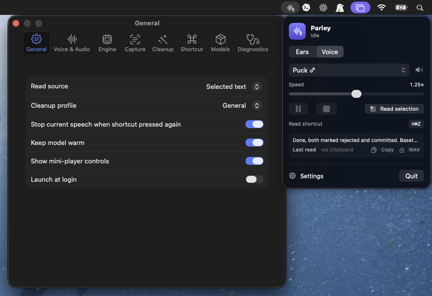

# Parley

**[Fluid Voice](https://github.com/altic-dev/FluidVoice), but for text-to-speech.** Fluid Voice turns your voice into text locally; Parley does the reverse — highlight text anywhere on macOS, press a hotkey, hear it read aloud in a high-quality local [Kokoro](https://github.com/hexgrad/kokoro) voice. Fully local, fully private — no cloud, no account, no tracking.



The app **bundles its own Python** — nothing else to install. Pick whichever install suits you:

**① Homebrew (easiest — one command, no Gatekeeper prompt):**
```bash
brew install --cask latent-variable/tap/parley
```

**② Download the DMG:** grab `Parley-*.dmg` from [Releases](https://github.com/latent-variable/Parley/releases), drag to Applications. It's open-source and not notarized, so clear the download quarantine once, then open:
```bash
xattr -cr /Applications/Parley.app
```

**③ Build from source** (no quarantine at all; needs Xcode command-line tools):
```bash
git clone https://github.com/latent-variable/Parley.git
cd Parley && bash scripts/build_app.sh && open dist/Parley.app
```

First launch downloads the Kokoro model (~340 MB) automatically. Grant Accessibility when prompted (or use Clipboard mode — no permission needed), then select text in any app and press **⌘⇧R**.

> **Why the extra step for ② / why "damaged"?** Apple's Gatekeeper blocks un-notarized downloads. Notarization needs a paid Apple Developer account, which this project doesn't use. Homebrew (①) handles it cleanly; building (③) sidesteps it entirely. Everything is local and the [source is all here](app/Sources/Parley).

## What it does

- **Read from anywhere** — Chrome, Safari, PDFs, Terminal, VS Code, Notes, Slack, Gmail, Markdown. Selected-text capture via the Accessibility API, with a clipboard-copy fallback that restores your clipboard. Or skip the hotkey: select text → right-click → **Services ▸ Read with Parley**.
- **Two voice engines, one dropdown:**
  - **Kokoro** (default) — 54 voices, 8 languages, instant, CPU. The everyday driver.
  - **Chatterbox Turbo HD** (opt-in) — markedly more natural speech on the GPU, with **voice cloning** from a ~10s reference clip. Ships a few clean open voices (CMU ARCTIC) and lets you add your own.
- **Streaming playback** — audio starts while the rest synthesizes. Play / pause / stop; **live speed** (drag mid-readout), pitch, volume; natural pauses at sentence/line/paragraph boundaries.
- **Smart cleanup** — strips Markdown, code fences, citations, terminal prompts, and more. Profiles for General / Markdown / Code / Blog / LLM output, plus editable regex rules with live preview.
- **Manage your models** — **Settings ▸ Models** shows each engine's size on disk and lets you delete or re-download Kokoro (~340 MB) and HD (~1.3 GB) to reclaim space. Deleting HD keeps your cloned voices.
- **Menu-bar utility** — status indicator, quick controls, settings. No dock icon. Fully local; HD audio is watermarked.

## Architecture

Native SwiftUI menu-bar app + a local Python sidecar over `127.0.0.1`, with two interchangeable engines behind one HTTP contract.

```
SwiftUI app ──HTTP──> FastAPI sidecar ──┬─ kokoro-onnx (ONNX, CPU)         ← default, instant
  hotkey · capture · cleanup            └─ Chatterbox Turbo (PyTorch, MPS) ← opt-in HD, cloning
  AVAudioEngine player                     streaming int16 PCM @ 24 kHz
```

- `backend/server.py` — `/health`, `/engines`, `/voices?engine=`, `/synthesize` (streams PCM, `engine` param; `?format=wav` for export), HD install + starter-voice endpoints.
- `backend/chatterbox_engine.py` — the HD engine, lazy-loaded (no torch until used).
- `app/Sources/Parley/` — hotkey (Carbon), capture (AX + clipboard), preprocessing, AVAudioEngine player (pre-buffered streaming, live speed via time-stretch), settings, views.

**The default app stays small (~88 MB).** Kokoro is bundled; the HD engine (torch + Chatterbox, ~1.3 GB) downloads on demand into Application Support **only when you enable it** — never in the shipped app. Both engines then run in one process (kokoro-onnx happily coexists with torch on numpy 1.26).

HD note: Chatterbox is a cloning model — each HD voice is a ~10s reference clip. Output is watermarked (Resemble Perth). **Only clone voices you have the rights to use.** See [docs/MODELS.md](docs/MODELS.md).

## Develop

```bash
# backend only (auto-creates venv on first run)
bash scripts/run_backend.sh

# build + run the app
bash scripts/build_app.sh && open dist/Parley.app

# run the preprocessing self-test
cd app && swift build && "$(swift build --show-bin-path)/Parley" --selftest
```

Models live in `~/Library/Application Support/Parley/models`. The venv lives in `~/Library/Application Support/Parley/venv`.

### Tests

```bash
# Swift: preprocessing + clipboard-restore invariant
cd app && swift build && "$(swift build --show-bin-path)/Parley" --selftest
# Backend: chunking, synth edge cases, long docs, providers, WAV export
cd backend && python -m pytest tests/ -v
```

### Acceleration

Compute provider is selectable in **Settings ▸ Diagnostics ▸ Acceleration** (or `MURMUR_PROVIDER=auto|cpu|coreml`). `auto` uses **CPU on purpose**: Kokoro is small (82M), and the vectorized CPU path benchmarks as fast as or faster than CoreML (GPU/Neural Engine) on Apple Silicon — CoreML offloads most ops back to CPU anyway. CoreML is available as a toggle; CPU is always the fallback. `/health` reports the active provider.

Why Kokoro, and what could replace it: [docs/MODELS.md](docs/MODELS.md) tracks candidate models against Parley's CPU-only / ONNX / permissive-license constraints.

## Models / voices

Auto-downloaded on first run from the [kokoro-onnx releases](https://github.com/thewh1teagle/kokoro-onnx/releases). To do it manually:

```bash
cd backend && source "$HOME/Library/Application Support/Parley/venv/bin/activate"
python download_models.py
```

## Permissions & privacy

Parley runs **100% on your Mac**. No account, no telemetry, no analytics, and no network calls after the one-time model download. Synthesis happens locally in the bundled Kokoro engine. Every line of that is in this repo — read it.

**One permission: Accessibility.** macOS gates two things behind it, and Parley needs them to do its single job — turn the text you point at into speech:

| What | Why Accessibility is required |
|---|---|
| Read the **selected text** in the frontmost app | macOS only lets a trusted app query another app's selection (`AXUIElement`) |
| Simulate **⌘C** for the clipboard fallback | Posting a synthetic keystroke (`CGEvent`) requires the same trust |

That's the entire reason. Parley does **not** log your keystrokes, watch what you type, take screenshots, read your screen, or send anything anywhere. It reads one thing — the text you explicitly select and trigger — and speaks it. The capture code is [`TextCapture.swift`](app/Sources/Parley/TextCapture.swift): it reads the current selection (or copies it, then **restores your clipboard**) and nothing else.

**Don't want to grant it?** Switch **Read source → Clipboard** (menu bar ▸ *Use Clipboard*). Then copy text yourself and press the shortcut — reading the clipboard needs no permission at all.

**Grant it:** first launch prompts you; or System Settings ▸ Privacy & Security ▸ Accessibility ▸ enable **Parley**.

**If the toggle is on but Parley still asks:** the app is ad-hoc signed, so each reinstall is a new identity to macOS and the old grant goes stale. Remove Parley from the list (**−** button), then grant again. To stop this for good, run `scripts/setup_signing.sh` once — it creates a stable signing identity so the grant survives updates. See [docs/PRIVACY.md](docs/PRIVACY.md).

## Known limitations

- **Not notarized.** The app bundles its own Python, so it's large and ad-hoc signed — a DMG downloaded from a browser is quarantined and macOS says *"damaged and can't be opened."* Until it's notarized (needs an Apple Developer account), clear the quarantine once after copying to Applications: `xattr -cr /Applications/Parley.app`, then open. Building locally avoids this entirely.
- Pitch is a post-process shift (AVAudioUnitTimePitch); Kokoro has no native pitch control.
- Capture defaults to **clipboard** (most reliable). Accessibility selected-text is offered as a mode but varies by app. Capture never reads a stale clipboard, so a failed copy reads nothing rather than the wrong text.
- First launch still downloads the Kokoro model (~340 MB) automatically.

## Roadmap

Shipped:

- [x] Hotkey → local Kokoro speech, streaming playback (first audio ~0.2s).
- [x] Clipboard + Accessibility capture, with stale-clipboard protection.
- [x] Cleanup profiles + editable rules, WAV export, launch-at-login.
- [x] Menu-bar app, settings, diagnostics, model auto-download.
- [x] Drag-to-install DMG + GitHub release.
- [x] Selectable compute provider (auto/CPU/CoreML) + backend test suite.
- [x] **Self-contained: bundles its own Python runtime** — runs on Macs with no Python installed.
- [x] **Chatterbox Turbo HD engine** — opt-in GPU voice cloning, unified voice picker, live speed, pre-buffered streaming.
- [x] **Right-click → Read with Parley** (macOS Services menu).
- [x] **Model management** — delete / re-download either engine from Settings ▸ Models.

Next:

- [ ] Notarize + Developer ID sign (drop the quarantine/right-click step — needs Apple Developer account).
- [ ] Per-app capture overrides and audio caching.
- [ ] More export formats (MP3/AAC) and "save while reading".

## License

MIT. Kokoro weights are Apache-2.0 (hexgrad/Kokoro-82M). Chatterbox is MIT (Resemble AI); HD reference voices from CMU ARCTIC (free to use). HD audio is watermarked; clone only voices you have rights to.
