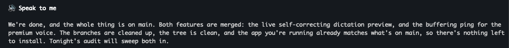
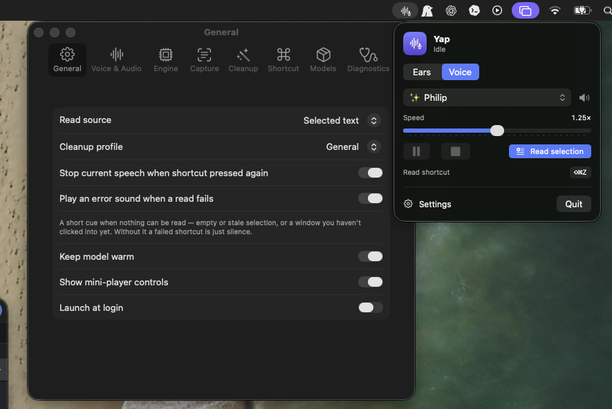

<div align="center">


https://github.com/user-attachments/assets/5b9b47f6-a25a-4489-8f23-fbfba03b5969


# Yap

**Talk to your Mac. It talks back. You both yap.**

Your keyboard is slow and your eyes are slower. Give your Mac ears and a voice instead: hold a key and talk, your words type themselves; highlight anything and hear it out loud in a shockingly human voice. Fully local. No cloud, no account, nobody listening but you.

[Install](#install) · [The loop](#the-loop) · [What it does](#what-it-does)

</div>

---

You think faster than you type, and way faster than you read. So stop doing both. **Yap** gives your Mac two things it was missing: **ears** (hold a key, talk, and local [Parakeet](https://huggingface.co/nvidia/parakeet-tdt-0.6b-v2) drops your words right where the cursor is) and a **voice** (highlight anything, tap a shortcut, hear it read back in a real [Kokoro](https://github.com/hexgrad/kokoro) or Pocket voice). Until Neuralink wires you straight into your coding agent, this is the shortcut: quit typing *at* your computer, start yapping *with* it.

## Install

The app bundles its own Python — nothing else to install.

```bash
# ① Homebrew (easiest, no Gatekeeper prompt)
brew install --cask latent-variable/tap/yap

# ③ Build from source (needs Xcode command-line tools)
git clone https://github.com/latent-variable/Yap.git
cd Yap && bash scripts/build_app.sh && open dist/Yap.app
```

**② DMG:** grab `Yap-*.dmg` from [Releases](https://github.com/latent-variable/Yap/releases), drag to Applications, then clear the one-time quarantine (it's open-source, not notarized): `xattr -cr /Applications/Yap.app`.

First launch grabs the Kokoro model (~340 MB). Grant Accessibility + Microphone when asked (or use Clipboard mode, no permission needed). Then: **⌘⇧D** to dictate, **⌘⇧R** to read the selection aloud.

## The loop

The real unlock is closing the loop with an **AI coding agent**. You stop touching the two slowest parts of the workflow:

1. **You → agent (ears).** ⌘⇧D, ramble your prompt, press again. No keyboard.
2. **Agent → you (voice).** Highlight its answer, ⌘⇧R, it reads back. No eyes.

Talk, listen, repeat — pair-program with something that briefs you out loud while you stare out the window.

### Make your agent talk back

Agent output is full of code and tables that sound awful aloud. One instruction fixes it — drop this into your agent's `AGENTS.md` / `CLAUDE.md` / system prompt:

```md
## 🔊 Speak to me
End substantive replies with a `## 🔊 Speak to me` section: a few plain,
conversational sentences narrating what you did, what it means, and what's next —
written to be *heard*, not skimmed. No markdown, code, tables, or symbols inside
it (a TTS tool reads "asterisk" and "backtick" out loud). Spell numbers and flags
out in words. Skip it for trivial one-liners.
```

Now highlight that section, hit ⌘⇧R, and your agent literally briefs you:



## What it does



- **Ears — dictate into anything.** Hold the shortcut, talk, release. Streaming Parakeet STT on the Apple Neural Engine: a live, self-correcting preview as you speak, then an accurate final pass pasted at your cursor. English or 25-language multilingual. Optional chime + filler-word cleanup ("um"/"uh", never real words).
- **Voice — read from anywhere.** Chrome, PDFs, Terminal, VS Code, Slack, Gmail. **Auto** capture grabs your selection directly where it can (Accessibility) and falls back to your clipboard for apps that don't expose their selection (iTerm, other terminals), or right-click → **Services ▸ Read with Yap**.
- **Two engines, one dropdown.** **Kokoro** — 54 voices, 8 languages, instant, CPU. **Pocket TTS** (opt-in) — 26 markedly more natural built-in voices, ~10x realtime on CPU, plus **voice cloning** from a ~20s clip (cloning needs a free Hugging Face token).
- **Streaming playback** — audio starts while the rest synthesizes; live speed/pitch/volume, natural pauses. **Smart cleanup** strips Markdown/code/citations (General/Markdown/Code/Blog/LLM profiles + custom regex).
- **Flexible shortcuts** — a normal chord (⌘⇧R) or a **modifier-only chord** like ⌥⌘ (the "Alt+Win" press), held and released — handy for push-to-dictate.
- **Menu-bar only, fully local.** Manage/delete each model from Settings ▸ Models. Clone only voices you have rights to.

> **A clipboard quirk worth knowing.** In apps that don't expose their selection (iTerm, other terminals), Auto mode reads your clipboard. Two harmless side effects follow: highlighting in iTerm (copy-on-select) replaces whatever you had copied, and pressing Read with nothing selected speaks whatever is currently on your clipboard. You stop noticing it fast. Want strict selection-only? Settings ▸ Read source → **Selected text**.

## Permissions & privacy

100% on your Mac. No account, no telemetry. The only network calls are the one-time model download and an optional once-a-day update check (toggle off in Settings ▸ General); nothing else, nothing personal sent. **Accessibility** lets Yap read your selection and paste; **Microphone** feeds dictation. Audio never leaves the machine. Don't want to grant Accessibility? Switch **Read source → Clipboard** and copy text yourself first. Details: [docs/PRIVACY.md](docs/PRIVACY.md).

**Don't take my word for it.** It's 2026. Point your coding agent (Claude Code or similar) at this repo and have it read the source and confirm there's no network path beyond the one-time model download and the optional daily update check. Or build your own from source and use these binaries as a reference. If it holds up, a ⭐ is appreciated.

> Ad-hoc signed, so each reinstall is a new identity to macOS and the Accessibility grant can go stale — remove Yap from the list and re-add, or run `scripts/setup_signing.sh` once for a stable identity.

## Architecture

Native SwiftUI menu-bar app. **Voice** (TTS) talks to a local Python sidecar over `127.0.0.1`; **ears** (STT) run fully in-app on the ANE — no sidecar, no network.

```
SwiftUI app ──HTTP──> FastAPI sidecar ──┬─ kokoro-onnx (ONNX, CPU)      ← voice: default, instant
  hotkey · capture · cleanup            └─ Pocket TTS (PyTorch, CPU)   ← voice: opt-in, natural + cloning
  AVAudioEngine player                     streaming int16 PCM @ 24 kHz
  AVAudioEngine mic ──► FluidAudio / Parakeet (CoreML, ANE) ← ears: streaming dictation, in-app
```

The default app stays small (~88 MB): Kokoro is bundled; the Pocket engine (torch, ~1 GB) downloads on demand only when you enable it. Module map: [docs/ARCHITECTURE.md](docs/ARCHITECTURE.md).

## Develop

```bash
bash scripts/run_backend.sh                       # backend only (auto-creates venv)
bash scripts/build_app.sh && open dist/Yap.app    # build + run
cd app && swift build && "$(swift build --show-bin-path)/Yap" --selftest   # Swift tests
cd backend && python -m pytest tests/ -v          # backend suite
```

State lives in `~/Library/Application Support/Yap` (models, venv, cloned voices) — gitignored, machine-local.

## License

MIT. Kokoro weights Apache-2.0 (hexgrad/Kokoro-82M); Pocket TTS by [Kyutai](https://github.com/kyutai-labs/pocket-tts) (catalog model open; cloning model gated, needs your own Hugging Face token); starter reference voices from CMU ARCTIC. Dictation uses [FluidAudio](https://github.com/FluidInference/FluidAudio) (Apache-2.0) running NVIDIA Parakeet. Clone only voices you have rights to.
